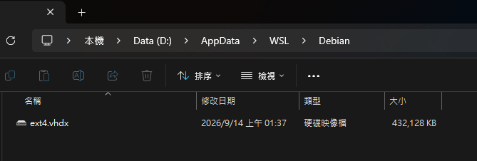

## 前言

又是新的學期啊，這次教授突然要我們帶 Linux Shell 的教學，只好拿去年的教材改一改（去年是教 pwsh 入門），為了準備教材也是多裝了一個 Debian distro，乾乾淨淨方便演示～但我安裝的時候耍笨了沒指定位置，裝到了預設的目錄，現在要來補救w。

參考了一下這篇文章：[[教學2020] 如何將 WSL Distro (發行版) 安裝至其他硬碟](https://hackmd.io/@Kuihao/wsl)，過去要移動位置還是有點學問的，但現在是 2026，已經有更懶人的方式啦，只要一行指令就能搞定了！！

:::important
需要 WSL 版本大於 `2.3.11`，如果是更舊的版本或是 WSL1，請參考上面提到的文章使用傳統方式移動。
:::

:::tip
補充一下如果要安裝的時候指定路徑：

```sh frame="none" "distro_name" "location_path"
wsl --install -d distro_name --location location_path
```
:::

## 開搞

1. 開始之前記得確保 wsl 完全關閉（如果最近有開啟）：

```sh frame="none"
wsl --shutdown
```

2. 一行指令遷移！藍框處記得打上你真實的 distro 名稱以及路徑：

```sh frame="none" "distro_name" "new_location"
wsl --manage distro_name --move new_location
```

實際操作截圖：


順利移動過來了：



只能說非常的 EZ，現在真的很方便啊，就連以前要自己徒手裝的 Arch WSL（我還寫過[文章教學](https://blog.yuuzi.cc/posts/guides/arch-wsl-install/)），現在也都可以直接安裝，WSL 也是越來越懶人了～

> 參考資料：[Change of WSL installation location](https://superuser.com/questions/1714345/change-of-wsl-installation-location)
