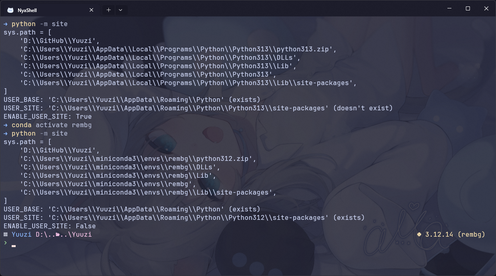

## 前言

前幾天在整理 Conda 一些過時的環境，也把有些不知道為何損壞的環境給重裝了一下，結果就這樣不偏不倚的踩到了一個巨坑上了(╯°Д°)╯ ┻━┻。明明前一刻才安裝好的環境，怎麼一執行主程式就噴錯顯示套件東缺西缺，太詭異了，一查才知道原來是 User-Site 的鍋！

## 還原事發現場

事情大概是這樣的，我在全新建立、熱騰騰的 Conda 環境中安裝套件，結果居然大量出現類似這樣的 log：

```console "Requirement already satisfied:"
Requirement already satisfied: attrs in C:\Users\<User>\AppData\Roaming\Python\Python312\site-packages
```

甚至出現依賴衝突的訊息，比如這樣：

```console "dependency conflicts" del="ERROR:"
ERROR: pip's dependency resolver does not currently take into account all the packages that are installed. This behaviour is the source of the following dependency conflicts.
selenium 4.35.0 requires typing_extensions~=4.14.0, but you have typing-extensions 4.16.0 which is incompatible. 
```

接著我就有點不信邪執行主程式，果然馬上報錯：

```console "ModuleNotFoundError:"
ModuleNotFoundError: No module named 'attrs'
```

## 核心原因分析

雖然標題罵 Conda 罵得很兇，但其實元兇應該算是 Python 的鍋 ◑ω◐，也就是 User-Site 導致的問題。

:::note
Python 的 User-site 機制（源自 PEP 370）是 Python 為非 root / 非管理員使用者設計的一種安裝機制。它的初衷很單純：讓一般使用者在沒有系統全域寫入權限的情況下，依然能把套件裝進自己的 home 目錄。
:::

但是這就算是好心辦壞事吧，如果曾經用 `pip install --user <package_name>` 這類的指令安裝套件的話，pip 不會把套件寫到系統預設的路徑，而是寫到使用 home 目錄下的位置：

- Linux: `~/.local/lib/pythonX.Y/site-packages`
- Windows: `%APPDATA%\Python\PythonXY\site-packages`

當 Python 直譯器啟動時，裡面的 `site.py` 在一般情況下會將 `ENABLE_USER_SITE` 設定為 `True`，也就是說會去自動掃描上述的路徑，只要 major.minor 版本有對上，比如一個 `3.12.5`，一個 `3.12.14`（patch 版號不用一樣），路徑就會被塞到 `sys.path`。

接下來安裝的時候 pip 就會掃描這些路徑，發現有些套件已經存在了，比如上面舉例的 `attrs`，就會跳過安裝，又或是因為這些已經存在的套件產生衝突。

但環境安裝完畢後，如果是執行一些獨立封裝的執行檔或是特定路徑環境時，如果 Python 沒有正確從 site-packages 那裡載入套件，就會發生找不到套件的問題。

:::tip[那 venv 會不會有事呢？]
venv 環境根目錄含有 `pyvenv.cfg`，並且預設 `include-system-site-packages` 為 `false`，直譯器在執行時會自動將 `site.ENABLE_USER_SITE` 設定為 `False`，因此不會受到 user-site 的影響。

_突然覺得 uv 好香，但 Conda 管理 NVIDIA 相關驅動與 C++ 依賴比較方便，難以割捨啊..._
:::

## 解決方法

這裡列了常見的 3 種方法來解決這個問題，當然如果本身就沒有全域的 Python 或是 User-Site 的話就沒這麼多破事了，遇事不決虛擬環境啟動也是一種解法 d(`･∀･)b

### 方法 1：對單一 Conda 環境個別設定

這個方法多平台通用，而且是 Conda 原生的做法，可惜的是必須重啟環境以及一個一個環境設定，Conda 沒有提供一個設定可以對全域生效。<small>但你可以寫一個腳本 loop 一下現有環境(ゝ∀･)⌒☆</small>

```sh "env_name"
conda env config vars set PYTHONNOUSERSITE=1
conda deactivate
conda activate env_name
```

可以看到設定後確實在環境啟動後關閉了 `ENABLE_USER_SITE`：



### 方法 2：使用者層級全域關閉（較不推薦）

簡單暴力的直接將變數寫到當前的使用者設定中，設定好後永久生效，但缺點是全域工具可能就被砍一刀廢掉了（找不到套件之類的），有些常用/無所謂的套件也沒辦法跨環境共享了。

- **Windows (PowerShell):**
    寫到 Windows 登錄檔的使用者環境變數區，然後重啟終端機。
    ```ps1 frame="none"
    [Environment]::SetEnvironmentVariable("PYTHONNOUSERSITE", "1", "User")
    ```

- **Windows (Command Prompt):**
    ```cmd frame="none"
    setx PYTHONNOUSERSITE 1
    ```

- **Linux (Bash / Zsh):**
    ```sh frame="none"
    # Bash
    echo 'export PYTHONNOUSERSITE=1' >> ~/.bashrc
    source ~/.bashrc

    # Zsh
    echo 'export PYTHONNOUSERSITE=1' >> ~/.zshrc
    source ~/.zshrc
    ```

### 方法 3：使用 `conda-ecosystem-user-package-isolation` 包自動去除外部路徑

這個包本質上在做的事與方法 1 相同，只是自動化了這個流程，每次 `conda activate` 時會在 `etc/conda/activate.d/` 與 `etc/conda/deactivate.d/` 放入啟動腳本，這些腳本會設定環境變數 `PYTHONNOUSERSITE=1`。你也可以把這個包加入自動的工作流之中，讓每個環境創建時自動附帶這個包。

```sh
conda install conda-ecosystem-user-package-isolation -c conda-forge
```

:::warning
以上方法為本人在網上蒐集並整理的相關解法，但沒有全部實際驗證，若與實際上體驗有所差異，歡迎在下方留言區提出。
:::
