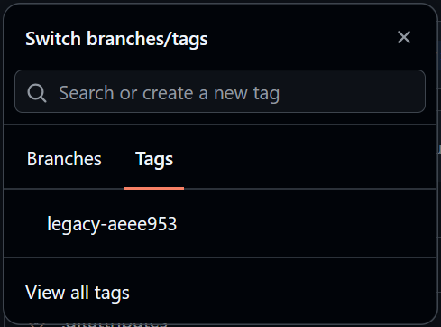
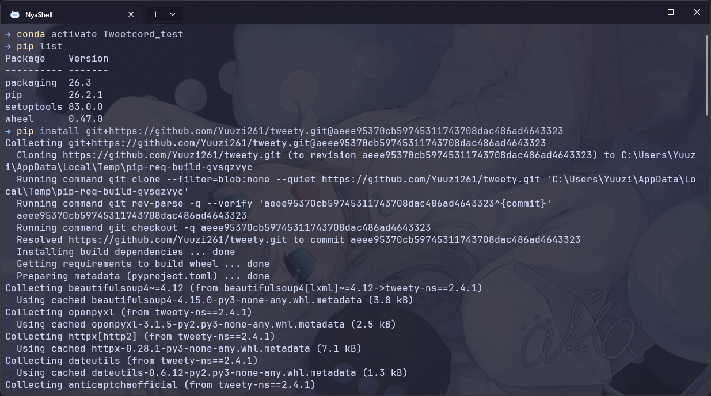
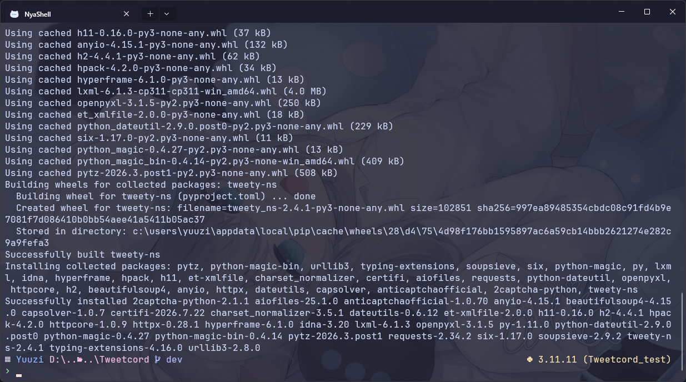

# 事件起因

這輩子沒想過會遇到這樣的問題，事情是這樣的。首先，[tweety-ns](https://github.com/mahrtayyab/tweety) 的開發者因為工作繁忙，近期是比較沒有在維護，導致之前因為 X(Twitter) 前端改動而出現的登入問題遲遲沒有修復，但我有一個基於此套件開發的 Discord Bot: [Tweetcord](https://github.com/Yuuzi261/Tweetcord)，可沒辦法等作者慢慢修啊，所以最好的方法就是我自己 fork 過來然後依照這個 [issue](https://github.com/mahrtayyab/tweety/issues/295) 改一改，接著把 `requirements.txt` 指向這個 fork 的庫，讓大家先暫時用著...

到目前為止還沒有什麼問題對吧？但我當時想說也沒有要 PR 又是臨時修復啥的，我就沒有單獨開一個分支來放這個改動，直接推到 main 上了... 時間來到現在，當初挖的坑也是被我狠狠地跳了下去¯\\\_(ツ)\_/¯

最近我發現 `tweety-ns` 又有點問題了，所以目前是打算先同步作者的 main 分支變更後改一改發個 PR 看看作者什麼時候要理我同時先暫時將 `Tweetcord` 的依賴指向新的 commit。那麼問題來了，現在我的 main 分支已經有我的提交，然後 `Tweetcord v0.7.2` 的依賴又指著這個提交，如果我直接拿作者的覆蓋掉的話，那麼一旦有人從原始碼本地安裝時 100% 抓不到依賴。

聰明的你應該已經想到了：簡單啊，從我自己還沒提交的節點分支出去後，就能在這個分支上同步作者的最新變更，然後從該分支修改 bug 發 PR 歷史就能對得上！沒錯！這也是一個方法，但我現在想讓我的 main 分支恢復健康，也就是以後我可以無憂無慮地在 main 分支 sync 作者的改動，然後透過開分支去進行貢獻的模式。

那麼該怎麼做才能保證下游 `Tweetcord` 不會從此抓不到依賴，同時，又重新讓 main 可以 sync 上游的 `tweety-ns` 呢？這題問得非常好！！廢話了這麼久終於要進入正題了σ ﾟ∀ ﾟ) ﾟ∀ﾟ)σ

# 冷知識時間

- Ｑ：只要知道 SHA，commit 就會永久存在嗎？
- Ａ：你覺得有可能嗎？傻了吧（X
    - Dangling / Unreachable Commit：如果一個 commit 沒有被任何 branch 或 tag 指向，它會失去所有引用。
    - 大多數 Git 伺服器（包含 GitHub）預設不允許客戶端直接 fetch 未被任何命名引用（ref）包含的獨立 commit，pip 在全新環境執行 git clone / fetch 時可能直接報錯。
    - Git GC（垃圾回收機制）：懸空的 commit 在經過一段時間後會被後台的垃圾回收機制永久清除。注意：由於上一點的緣故，不用等到 GC，只要 commit 一被覆蓋就會出事！

所以結論跟上面說的一樣，只要我覆蓋掉那個提交，基本上就出事了(ﾟ∀ﾟ;)

# 解決方法

## 建立錨點（Anchor）

所以說到底要怎麼辦呢？答案是可以用 Git Tag 在遠端建立一個永久的參照（ref）。

```sh frame="none" "tag_name" "commit_sha"
git tag tag_name commit_sha
```

舉個實際例子：

```sh frame="none"
git tag legacy-aeee953 aeee95370cb59745311743708dac486ad4643323
```

然後推到遠端：

```sh frame="none" "tag_name"
git push origin tag_name
```

這樣這個 commit 就不會被 GitHub 回收了，下游也不需要修改依賴的套件了：



## 放心地同步 Upstream 並進行下一步

確保這個 commit 的安危之後，就能放心地在 main 分支中嘎了它了σ`∀´)σ

```sh "https://github.com/<author>/<repo_name>.git"
# Add upstream remote
git remote add upstream https://github.com/<author>/<repo_name>.git

# Fetch latest code
git fetch upstream

# Sync main with upstream
git checkout main
git reset --hard upstream/main
git push origin main -f
```

實際測試看看 pip 能不能正確安裝依賴：




一切正常！非常好ヽ(✿ﾟ▽ﾟ)ノ

:::note
接下來就是愛幹嘛幹嘛了，比如開一個分支修修 bug 然後提交（我接下來就是要做這個），main 分支就保持與作者同步！這樣才是比較標準的姿勢～
:::
