# 前言

以前曾經搞過一次，但結果不盡人意，用起來卡卡的，後來就轉去用 WSL2 了，損耗也小。但我對 Hyprland 念念不忘，WSL2 上搞桌面感覺意義不大，而且聽說硬跑 Hyprland 也是卡得半死，那只好 VM 再次啟動了，這次會順利的（並沒有

:::note[觀前提醒]
預計篇幅較長，可透過右側快速導航到你想看的內容！
:::

# 在 VMware 創建 Arch Linux 虛擬機

有些太 trivial 的設定我會跳過，避免篇幅過長：

1. 選擇 Custom 可控制項比較多
    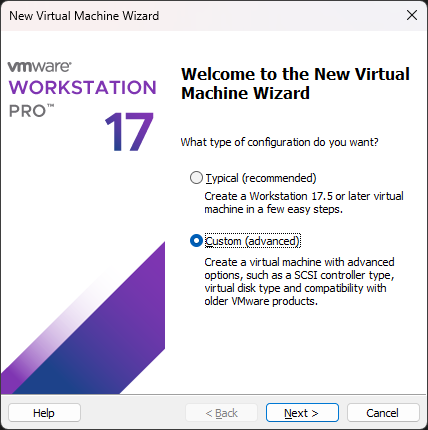 

2. 選擇[下載](https://archlinux.org/download/)下來的 `iso` 檔案
    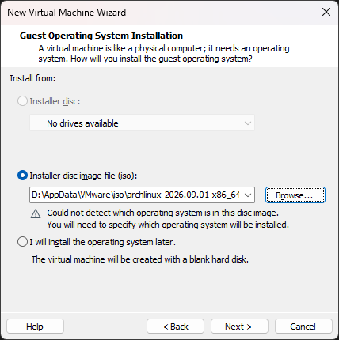  

3. Version 選擇 「Other Linux 6.x kernel 64-bit」
    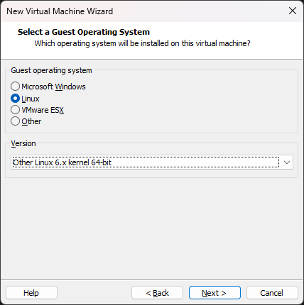  

4. 設定核心數，我這台宿主機算上超執行緒有 28 核，決定分配給它 8 核心，通常也不用分配太多，4~8 差不多吧。並且分配了 16 GB 的 RAM，這些都自己取捨就行了。
    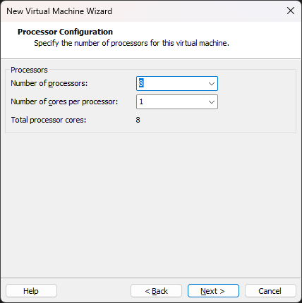  

5. 網路選 NAT，因為沒有要給外部連線，NAT 開箱即用又安全
    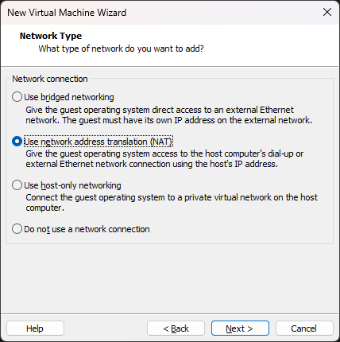  

6. I/O 控制器這裡用預設的 LSI 就行，後面用不到（因為後面要選 NVMe 嘎嘎快）
    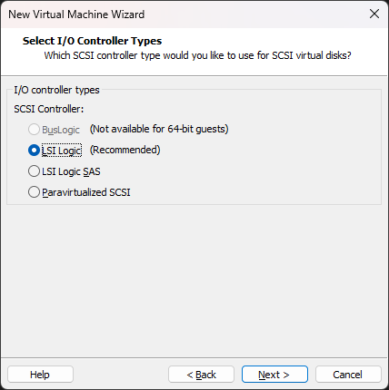  
    :::tip
    如果宿主機是 SATA SSD 或是 HDD，可以考慮：Paravirtualized SCSI
    :::

7. 選 NVMe
    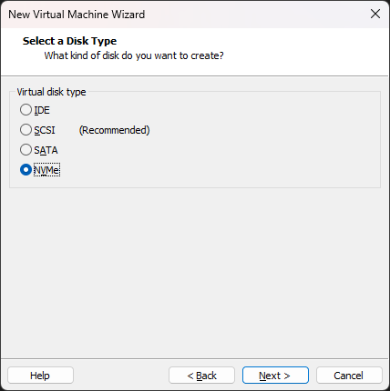  
    :::tip[宿主機不是 NVMe SSD 的場合]
    - SATA SSD: SATA / SCSI
    - HDD: SCSI
    :::

8. 這步就看需求，我沒有經常移動虛擬機的需求，為了最佳效能我選擇存成單一檔案
    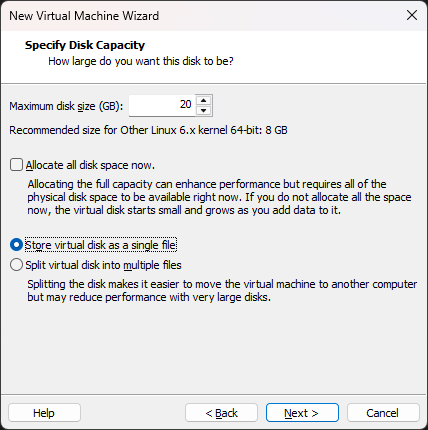  

9. 確認之前記得按「Customize Hardware...」找到 「Display」把 3D 加速勾起來
    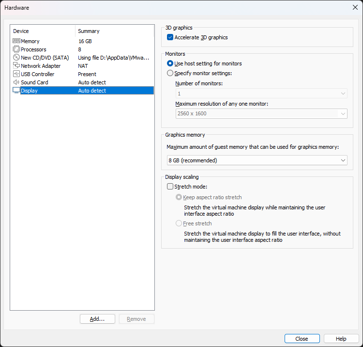  

10. ⚠️此時別急著開機，點擊「Edit virtual machine settings」→「Options」→「Advanced」→「Firmware type」修改成 `UEFI`。
    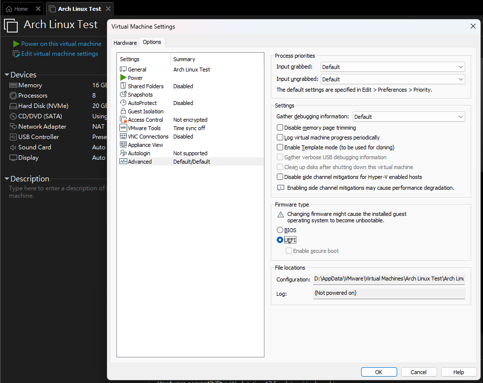  

# 安裝 Arch Linux

啟動虛擬機，進到安裝的 TTY 介面：
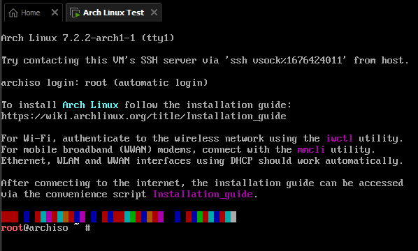  

## （可選）使用 SSH 遠端連線

如果你有開啟 Hyper-V，估計連在 TTY 打字都不跟手，這也是常見的坑之一，會在之後的內容提到，但如果使用 SSH 直接遠端虛擬機，就能在安裝過程中避免掉這種卡頓的情況，更重要的是複製貼上指令這點也會變得容易～好消息是 Arch Live ISO 原生已預裝並運行 `sshd` 服務，直接用就行！

1. 在虛擬機 TTY 設定臨時密碼並查 IP：
   ```bash
   passwd
   # 設定簡易密碼，如 1234

   ip a
   # 查看 ens33 等網卡的 inet IP（例如 192.168.222.137）
   ```

2. 在 PowerShell 直接連入：
   ```sh
   ssh root@192.168.222.137
   ```

這樣就能爽爽複製指令貼上了：
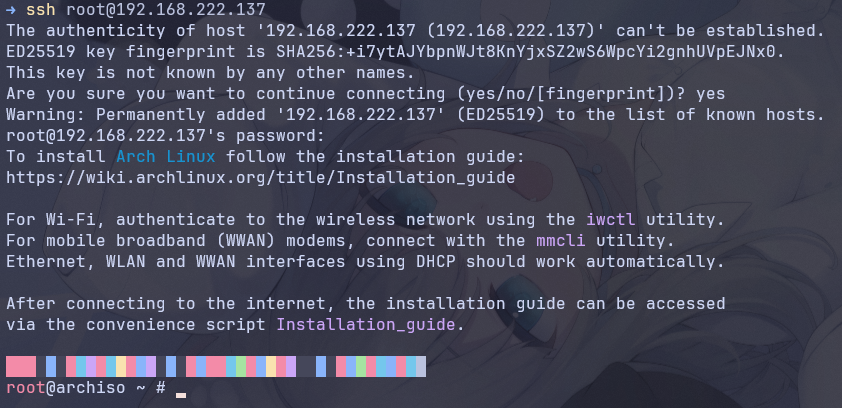  

## 磁碟分割與掛載

因為只分了 80 GB 給虛擬機，也沒啥太需要分的，主要就是分割出開機區以及根目錄系統區，另外用於此 blog 演示的虛擬機我只給了 20 GB，所以開機區我就設定更小一點了：

```
20 GB 虛擬磁碟 (/dev/nvme0n1)
├── [分割區 1: 512 MB]  ── FAT32 ── EFI 系統開機區 (ESP, 掛載至 /mnt/boot)
└── [分割區 2: 19.5 GB] ── EXT4  ── 根目錄系統區 (/, 掛載至 /mnt)
```

:::note
這裡不特別切 Swap 分區的原因是：
1. 現代 Linux 更推崇 zram 這類替代方案，在實體 RAM 中劃分一塊動態壓縮區域，不常活躍的記憶體頁面就壓縮後存放，變相增大記憶體空間，還能避免頻繁向 SSD 寫入。
2. 我給的記憶體非常充足（16 GB），這就是資本的力量（不要瞎掰好嗎。
3. 如果真的需要磁碟交換空間，也有 Swap File 這種方法，比 Swap 分割區更有彈性，隨時調整大小或是刪除。
:::

### Step 1. 建立 GPT 分割區（512 MB EFI，剩下的全部給 Root）

```sh
# 建立 GPT 分割表與分割區
parted -s /dev/nvme0n1 mklabel gpt

# 建立 512MB 的 EFI 開機分割區並標記為 ESP
parted -s /dev/nvme0n1 mkpart "EFI" fat32 1MiB 513MiB
parted -s /dev/nvme0n1 set 1 esp on

# 建立剩下的空間為根目錄 (root) 分割區
parted -s /dev/nvme0n1 mkpart "root" ext4 513MiB 100%
```

### Step 2. 格式化

```sh
# 格式化 EFI 分割區為 FAT32
mkfs.fat -F 32 /dev/nvme0n1p1

# 格式化根目錄為 EXT4
mkfs.ext4 /dev/nvme0n1p2
```

### Step 3. 掛載

```sh
# 先掛載根目錄到 /mnt
mount /dev/nvme0n1p2 /mnt

# 建立並掛載 /boot
mount --mkdir /dev/nvme0n1p1 /mnt/boot
```

使用 `lsblk` 指令確認：

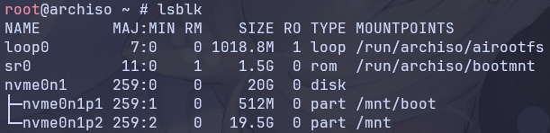  

:::note[Linux 小知識]
由於安裝階段根目錄（`/`）會被 Live USB 佔據，為了不讓下載以及寫入的檔案重開機後就消失，需要另外掛載，而系統內建的 `/mnt` 目錄就非常適合來做這件事，也省去創建臨時資料夾的功夫，等使用 `chroot` 等指令將根目錄切換到 `/mnt` 之後，未來做的操作就會作用於磁碟上的新系統了。
:::

## 基礎系統安裝

### 使用 `pacstrap` 指令安裝基礎系統與關鍵套件

```sh
pacstrap -K /mnt base base-devel linux linux-headers linux-firmware networkmanager open-vm-tools mesa neovim git sudo openssh
```

- `base`：Arch Linux 的最基礎環境，包含檔案系統工具、核心公用程式（比如 `ls`、`cp`）。
- `base-devel`：開發工具包（包含 `make`、`gcc`、`pkg-config` 等）。之後要用 AUR 裝軟體的話必備。
- `linux`：系統本統（Linux Kernel 本身）。
- `linux-headers`：Linux 核心標頭檔，若有編譯 DKMS 模組或底層連動需求時可選。
- `linux-firmware`：各種硬體的韌體驅動程式。
- `networkmanager`：網路管理器，除非你想當山頂洞人不然一定要裝。
- `open-vm-tools`：VMware 專用整合工具，畢竟我就是在 VMware 上面裝的嘛，肯定要的。
- `mesa`：開源的 3D 圖形驅動架構。之後要裝 Hyprland 這個 Wayland 合成器非常需要硬體加速。
- `neovim`：文字編輯器，比起 Nano 我還是更偏愛 Vim 這邊一點，雖然我有 99% 的快捷跟指令從沒記起來過
- `git`：沒啥好介紹的，老熟人一枚，版本控制工具。
- `sudo`：之後不可能一輩子都用 `root` 帳號，所以需要 `sudo` 這個權限管理工具。
- `openssh`：需要遠端的話必備。

如果載很慢的話估計是鏡像站嘎了，可以更新一下鏡像站：

```sh "country_name"
reflector --country country_name --latest 5 --sort rate --save /etc/pacman.d/mirrorlist
```

### 生成檔案系統掛載表

File System Table（檔案系統掛載表）是 Linux 系統中的一個核心設定檔，路徑固定在 `/etc/fstab`。沒有它的話每次電腦啟動都會忘記 OS 裝在哪顆硬碟的哪裡，每次啟動都要手動掛載，非常反人類。

```sh
# 生成檔案系統掛載表
genfstab -U /mnt >> /mnt/etc/fstab

# 檢查 fstab
cat /mnt/etc/fstab
```

實際結果：

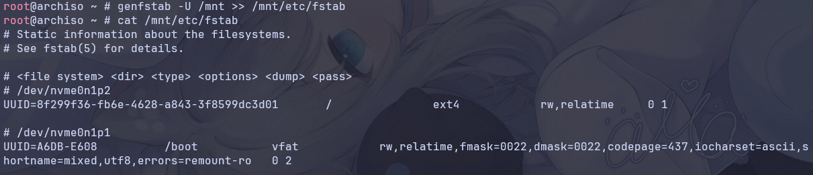  

:::note[掛載表欄位的意思]
- `<file system>`：裝置識別碼，通常是硬碟的 UUID。
- `<dir>`：掛載點。
- `<type>`：檔案系統類型。
- `<options>`：掛載參數，控制硬碟的讀寫行為，比如：`rw`（可讀寫）、`ro`（唯讀）。
- `<dump>`：備份標記。`0`（不備份）、`1`（每日備份）、`2`（隔日/排程備份）。
- `<pass>`：開機磁碟檢查順序。`0`（不檢查）、`1`（最優先檢查，只能給 `/` 使用）、`2`（第二優先檢查，剩下的分區）。
:::

### 系統初始化配置

切換進入硬碟系統：

```sh
arch-chroot /mnt
```

命令列提示符變了，此時已在新系統內部：

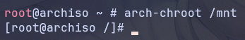  

進行剩下的環境設定：

```sh "username"
# 時區與硬體時間
ln -sf /usr/share/zoneinfo/Asia/Taipei /etc/localtime
hwclock --systohc

# 語系（預設採 en_US.UTF-8 避免 TTY 缺字型變方塊）
sed -i 's/#en_US.UTF-8 UTF-8/en_US.UTF-8 UTF-8/' /etc/locale.gen
sed -i 's/#zh_TW.UTF-8 UTF-8/zh_TW.UTF-8 UTF-8/' /etc/locale.gen
locale-gen
echo "LANG=en_US.UTF-8" > /etc/locale.conf

# 主機名稱
echo "arch-vm" > /etc/hostname

# 帳號與密碼
passwd
useradd -m -G wheel -s /bin/bash username
passwd username
# 下面這行是錯誤示範，請停下你正在複製貼上的手🫵
sed -i 's/# %wheel ALL=(ALL:ALL) ALL/%wheel ALL=(ALL:ALL) ALL/' /etc/sudoers

# 啟用關鍵系統服務
systemctl enable NetworkManager
systemctl enable sshd
systemctl enable vmtoolsd
```

:::caution
直接用 `sed` 修改 `/etc/sudoers` 是有這麼億點危險🤏，所以這裡補充一下比較標準的做法：
- 使用 `visudo`，它會在存檔時檢查語法是否正確。
- 或是在 `/etc/sudoers.d/` 新增獨立檔案（不易改壞主設定）：
    ```sh
    echo "%wheel ALL=(ALL:ALL) ALL" | EDITOR="tee" visudo -f /etc/sudoers.d/wheel
    ```
:::

### UEFI GRUB 開機引導配置

在 chroot 環境中安裝並設定 GRUB：

```sh
# 安裝套件
pacman -S --noconfirm grub efibootmgr

# 安裝 GRUB 至 EFI 分割區
grub-install --target=x86_64-efi --efi-directory=/boot --bootloader-id=GRUB

# 生成設定檔
grub-mkconfig -o /boot/grub/grub.cfg

# 退出並重開機
exit
umount -R /mnt
reboot
```

:::note
這裡先用 GRUB 最無腦，之後我考慮一下是要用更輕量的載入器還是把 GRUB 變得很油之類的，或是找找魚與熊掌皆得的，留給以後的我～
:::

重新啟動後就能看到非常老字號的 GRUB 介面：

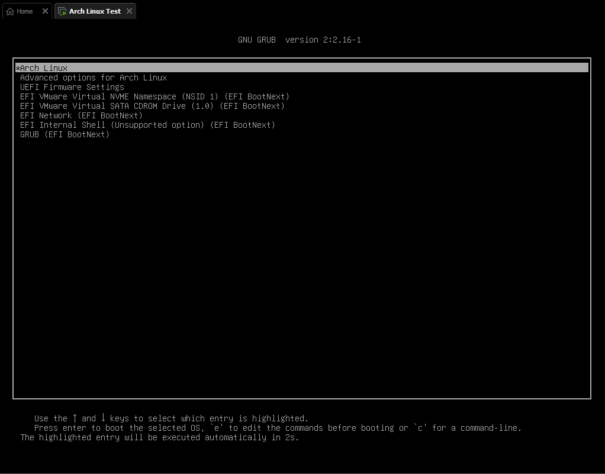  

:::tip
此時如果想用同一個 ip 連回去繼續遠端操作，會發現公鑰不匹配導致 OpenSSH 安全機制阻擋登入，因為當時宿主機記錄的是 Live ISO 暫存系統的公鑰：
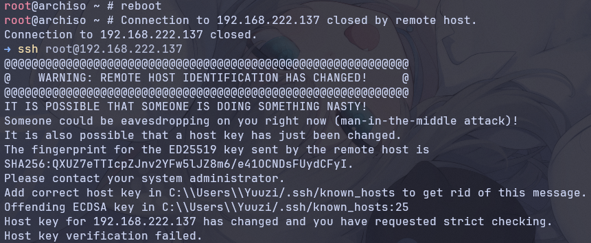  

解法也非常簡單，把舊的 IP 記錄清除即可重新連線：

```sh "username"
ssh-keygen -R 192.168.222.137
ssh username@192.168.222.137
```
:::

# 安裝 Hyprland

## 安裝 Hyprland 與終端機

```sh
sudo pacman -S --noconfirm \
  hyprland \
  foot \
  xdg-desktop-portal-hyprland \
  xdg-desktop-portal \
  polkit-kde-agent \
  qt5-wayland qt6-wayland \
  noto-fonts noto-fonts-cjk noto-fonts-emoji
```

- `hyprland`：基於 Wayland 協定的合成器/視窗管理器。本次的主角，從幾年前看到許多大佬搞的 rice 就對它非常著迷了。
- `foot`：輕量化、極速終端機模擬器。<small>不像某個 Powershell 加上沒幾個插件啟動就要幾千毫秒...</small>
- `xdg-desktop-portal-hyprland`：Hyprland 專屬的後端服務。主要負責螢幕錄影/分享（如 OBS、Discord、Meet）以及截圖等。
- `xdg-desktop-portal`：跨桌面環境的通用框架。它定義了沙盒應用（如 Flatpak）或一般應用如何安全地與系統互動（例如呼叫檔案選擇器、開啟 URL）。須與上述的 Hyprland 後端配合使用。
- `polkit-kde-agent`：圖形化權限驗證代理。當應用程式需要 root 權限時，它會彈出視窗要求你輸入密碼。
- `qt5-wayland qt6-wayland`：讓基於 Qt5 和 Qt6 框架開發的應用程式能夠原生在 Wayland 上運行，而非透過 XWayland 相容層，這能帶來更好的效能、縮放效果與外觀。
- `noto-fonts`：Google 老大開發的通用標準字型。
- `noto-fonts-cjk`：中日韓繁簡體字型。
- `noto-fonts-emoji`：彩色 Emoji 符號字型。

## 編輯 Hyprland 設定檔

### 運行 Hyprland 產生預設設定檔

```sh
start-hyprland
```

接下來依照下面步驟簡單修改設定檔

- 使用文字編輯器開啟設定檔：
    ```sh
    nvim ~/.config/hypr/hyprland.lua
    ```

- 移除設定檔自動生成警告：
    ```lua title="hyprland.lua" del={10}
    -- -- -- -- -- -- -- -- -- -- -- -- -- -- -- -- -- -- -- --

    -- AUTOGENERATED HYPRLAND CONFIG.                        --

    -- EDIT THIS CONFIG ACCORDING TO THE WIKI INSTRUCTIONS.  --

    -- -- -- -- -- -- -- -- -- -- -- -- -- -- -- -- -- -- -- --


    hl.config({ autogenerated = true }) -- remove this line to remove the warning 
    ```

- 修改螢幕解析度（這裡填適合自己螢幕的）
    ```lua title="hyprland.lua" del={8} ins={9}
    ------------------
    ---- MONITORS ----
    ------------------

    -- See https://wiki.hypr.land/Configuring/Basics/Monitors/
    hl.monitor({
        output   = "",
        mode     = "preferred",
        mode     = "2560x1440@60",
        position = "auto",
        scale    = "auto",
    })
    ```

- 修改預設終端機為 `foot`
    ```lua title="hyprland.lua" del={6} ins={7}
    ---------------------
    ---- MY PROGRAMS ----
    ---------------------

    -- Set programs that you use
    local terminal    = "kitty"
    local terminal    = "foot"
    local fileManager = "dolphin"
    local menu        = "hyprlauncher"
    ```
    :::note
    `kitty` 底層使用了 GLFW 函式庫。經過實測，在 VMware 的虛擬 3D 驅動環境下嘗試請求 Wayland Buffer 時，送出了不相容的格式參數，導致 Hyprland 直接拒絕並切斷連線，造成閃退。
    ```log
    [glfw error 65544]: Wayland: fatal display error: Broken pipe
    wl_display#1: error 1: invalid arguments for wl_surface#39.attach
    ```
    :::

- 將 `polkit-kde-agent` 加入自啟動
    ```lua title="hyprland.lua" ins={11-12} ins={17} del={10} del={16}
    -------------------
    ---- AUTOSTART ----
    -------------------

    -- See https://wiki.hypr.land/Configuring/Basics/Autostart/

    -- Autostart necessary processes (like notifications daemons, status bars, etc.)
    -- Or execute your favorite apps at launch like this:
    --
    -- hl.on("hyprland.start", function ()
    hl.on("hyprland.start", function ()
        hl.exec_cmd("/usr/lib/polkit-kde-authentication-agent-1")
        -- hl.exec_cmd(terminal)
        -- hl.exec_cmd("nm-applet")
        -- hl.exec_cmd("waybar & hyprpaper & firefox")
    -- end)
    end)
    ```

這樣就獲得最基本的 Hyprland 體驗了。


# 終端機卡頓問題排查及解法

## 問題原因

從進到 TTY 的那一刻起就能感受到明顯的卡頓以及不跟手，所以上面我使用了 SSH 遠端確保了安裝 OS 時的體驗，但此刻安裝已經完成的現在，必須來著手處理這個問題了。

當我按下「←」，文字游標紋絲不動；接著我按下「→」，游標居然朝左走了一步！
此時如果連續交替按「左右左右」，游標就會以非常優雅的姿態，永遠跟我的手指操作唱反調！

這在圖形渲染中被稱為經典的 「Off-by-one frame（雙重緩衝慢一幀）」。系統其實早就按鍵了，但渲染出來的新畫面卻被卡在顯卡後台的交換鏈（Swapchain）裡，必須等下一次輸入事件，上一幀的畫面才會被「擠」上螢幕。

## 解決方式

### 方法 1. 關閉 VFR（可變更新率）

為了省電與節省資源，Hyprland 預設為事件驅動。只有視窗內容產生變更時，才會排程渲染下一幀並觸發 Flip，畫面不動時完全停止運作。這一般來說是沒問題的，但很可惜遇上了 VMware。

具體來說我也不太清楚是卡在哪一層，但這個方法經過我的<small>~~窮舉~~</small>實測有效：

```lua title="hyprland.lua" ins={12-15}
-----------------------
---- LOOK AND FEEL ----
-----------------------

-- Refer to https://wiki.hypr.land/Configuring/Basics/Variables/
hl.config({
    ...

    animations = {
        enabled = true,
    },
    
    debug = {
        vfr = false,
    },
})
```

:::note
這個方法只能解決在 Hyprland 內操作終端機的卡頓現象，進入 Hyprland 之前的 TTY 介面照卡不誤。
:::

### 方法 2. 關閉 Hyper-V

這其實是一個被長年詬病的問題，在存放虛擬機的目錄底下打開 `vmware.log`，會發現因為被搶佔了硬體虛擬化層，VMware 為了兼容降級成 User Level Monitor 模式，導致無法直接調用 CPU 的 Intel VT-x 原生指令集。

```log title="vmware.log" "Monitor Mode: ULM"
2026-10-03T09:55:38.139Z In(05) vmx Monitor Mode: ULM
```

如果你沒有要用 WSL2、Docker 或是 Windows Sandbox 等等服務，可以把它關了就能體驗到非常舒服的虛擬機體驗。**記得 VFR 一樣要關掉。**

:::tip[但顯然我拋不開它們！！- BCD 雙開機選單]
WSL2 可是在 Windows 上跑 Linux 損耗比較小的好東西，怎能輕易說丟就丟？！所以目前我想到比較方便的解法是：透過 Windows BCD 新增一個獨立的開機分支：

```cmd "{YOUR-GUID-HERE}"
:: 打開 cmd 或是在 Powershell 輸入 cmd 進入命令提示字元模式
cmd

:: 複製現有開機配置為 VMware 專用原生模式
bcdedit /copy {current} /d "Windows 11 (No Hyper-V / VMware Native)"

:: 複製指令輸出的 GUID，為該配置關閉 Hyper-V 監控層
bcdedit /set {YOUR-GUID-HERE} hypervisorlaunchtype off

:: 設定開機選單倒數 5 秒
bcdedit /timeout 5

:: 退出
exit
```

- 平常開機：走原本的配置（`Windows 11`），該幹麻幹麻
- 需要 VM 啟動的時候：選 `Windows 11 (No Hyper-V / VMware Native)`，停用 Hyper-V，此時再打開 `vmware.log` 可以看到：
    ```log title="vmware.log" "Monitor Mode: CPL0"
    2026-10-02T20:41:35.175Z In(05) vmx Monitor Mode: CPL0
    ```
:::

### 其他備選方法

:::warning
這些方法我沒有經過嚴謹的驗證是否有效，僅作為資訊整理提供參考。
:::

1. 軟體游標補丁（防游標隱形與閃退）：
    VMware 的 `vmwgfx` 驅動對 Wayland 硬體游標支援不全，遇到游標消失時可以嘗試：
    ```lua title="hyprland.lua" ins={9-11}
    -----------------------
    ---- LOOK AND FEEL ----
    -----------------------

    -- Refer to https://wiki.hypr.land/Configuring/Basics/Variables/
    hl.config({
        ...

        cursor = {
            no_hardware_cursors = true,
        },
    })
    ```

2. 禁用 DRM 格式修飾符（防 Mesa SVGA 黑畫面）：
    ```lua title="hyprland.lua" ins={9}
    -------------------------------
    ---- ENVIRONMENT VARIABLES ----
    -------------------------------

    -- See https://wiki.hypr.land/Configuring/Advanced-and-Cool/Environment-variables/

    hl.env("XCURSOR_SIZE", "24")
    hl.env("HYPRCURSOR_SIZE", "24")
    hl.env("AQ_NO_MODIFIERS", "1")
    ```

3. 強迫虛擬機使用 Virtual USB 鍵盤控制器。如果宿主機在特定 Linux 核心下有鍵盤中斷遺失問題，可以在關機後編輯 `.vmx` 檔案，底部加上：
    ```ini  title="Arch Linux.vmx"
    keyboard.vusb.enable = "TRUE"
    mouse.vusb.enable = "TRUE"
    keyboard.allowBothIRQs = "FALSE"
    ```

# 結語

<span style="font-size: 2rem;">I use Arch, btw.</span>


圖源：[Ravimo - Arch-chan](https://www.pixiv.net/artworks/101776734)
