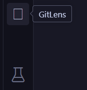
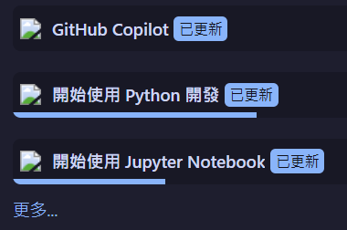
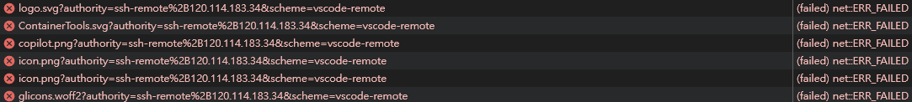
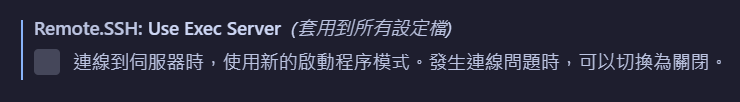
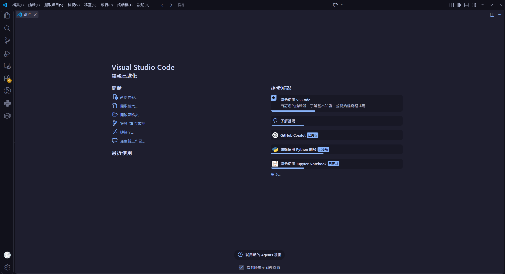

## 前言

事情是這樣的，最近因為研究都在遠端主機上搞，所以遠端基本上是家常便飯啊，但是！！連線到遠端後居然有圖標顯示不出來，變成白色的方框（Tofu）又或是破圖圖示，看得很燥啊，雖然功能都正常但一個不賞心悅目的介面可是會降低我的工作積極度的，哼～

- 豆腐，越看越燥：

- 歡迎介面的圖示也破圖...：

一開始只有注意到 GitLens 插件出問題，重裝了幾次，後來才知道不只有它，而且也不僅發生在單一的遠端桌面，所以透過刪去法先刪除了遠端以及插件本身的問題。

## 問題原因

廢話不多說馬上就來揭曉造成這個問題的原兇，其實這是 VS Code 目前版本一個死而復生的 bug：
[Remote-SSH 0.128.0 / VS Code 1.136.0: remote extension Activity Bar SVGs fail with `useExecServer=true` #11839](https://github.com/microsoft/vscode-remote-release/issues/11839)

原因就出在這個預設開啟的設定：`remote.SSH.useExecServer`，這是一個用來控制是否在啟動完整的 VS Code Server 之前，透過最小化控制伺服器來建立連線的引導模式設定。簡單來說，開啟這個設定可以讓連線速度更快、資源消耗更低但可能會在某些裝置上有相容性問題或不穩定。

根據相關 issue 的說法以及我這裡的實測，問題應該就是當 `useExecServer=true` 時 VS Code 會使用新協定 `vscode-managed-remote-resource://` 載入，但是這個協定的資源請求遇到了跨來源資源共用錯誤（CORS），疑似是此協定沒有被正確加入 CORS 允許清單（可能，但指出該問題的 [Issue #11686](https://github.com/microsoft/vscode-remote-release/issues/11686) 被標示已修復，這次問題發生的原因可能並不一致）。

從 **說明** $\rightarrow$ **切換開發人員工具**，打開 Console 標籤頁，可以看到錯誤訊息，從 Network 標籤頁也可以看到相關圖標、字型載入失敗的紀錄：

## 解決方法

既然這個 issue 死而復生又懸而未決，那最快解決的方法就是把 `useExecServer` 設定關掉，使用比較傳統的方式進行遠端連線。下面簡單說一下步驟：

1. 打開設定
2. 搜尋 `remote.SSH.useExecServer`
3. 取消勾選該設定

4. 重新啟動 VS Code 並連線到遠端

重新啟動後應該就可以看到圖標正常了：

又能繼續快樂地做研究了...嗎？

